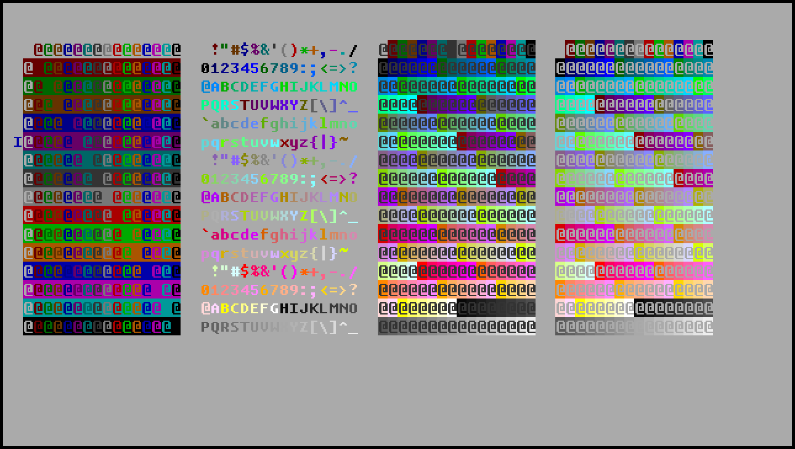
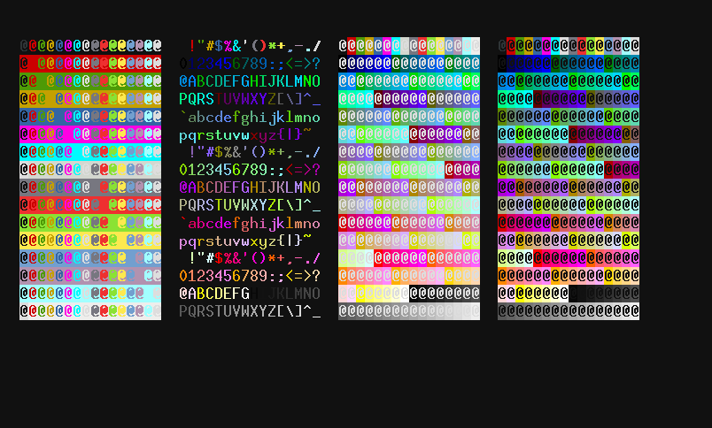
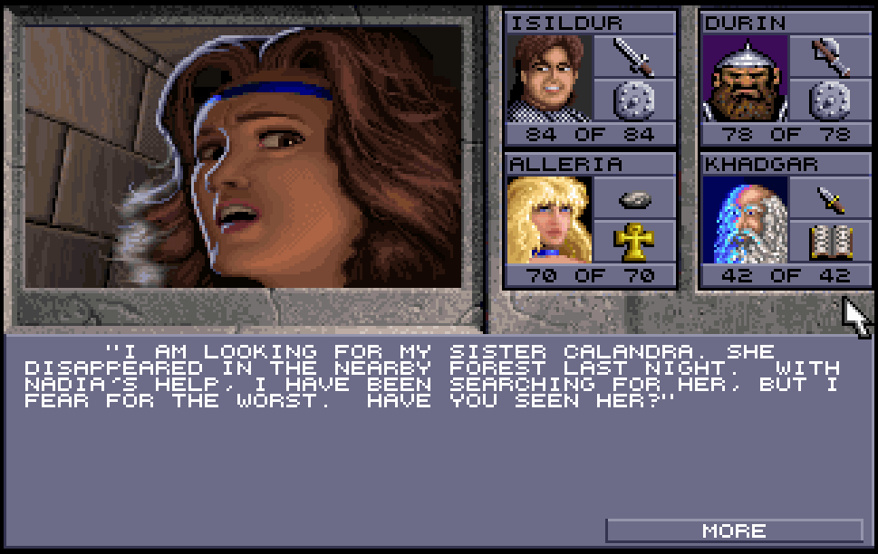
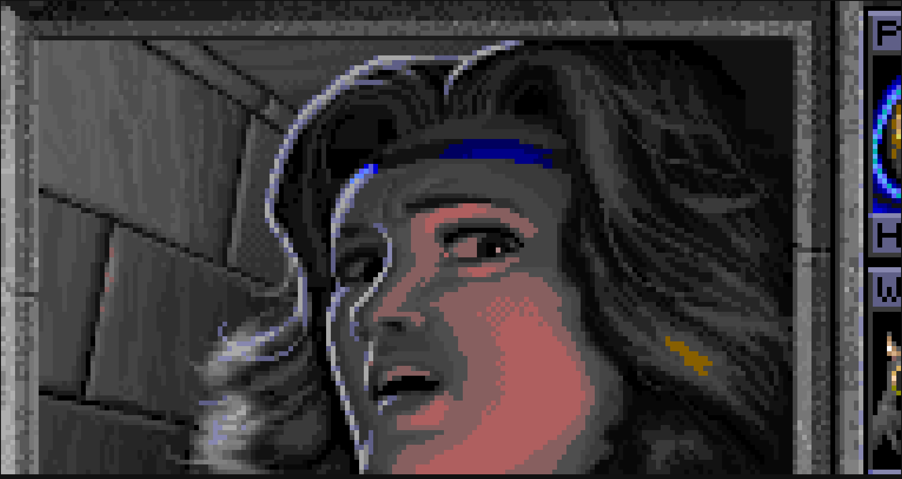

# Navni: A multi-backend character/pixel graphics display library

Navni is intended as a display library for both text graphics and pixel art
games. It can be built for either a native TTY console or for a desktop GUI
window, and text graphics will use the native TTY display on TTY.

You need to pick the backend using feature flags when using Navni, either
`--features=tty` for TTY or `--features=gui` for the GUI desktop backend.
To test the examples, run

    cargo run --features=tty --example demo

or

    cargo run --features=gui --example demo

## Obligatory screenshots

GUI | TTY
:---:|:---:
 | 
characters | characters
 | 
pixels | pixels
