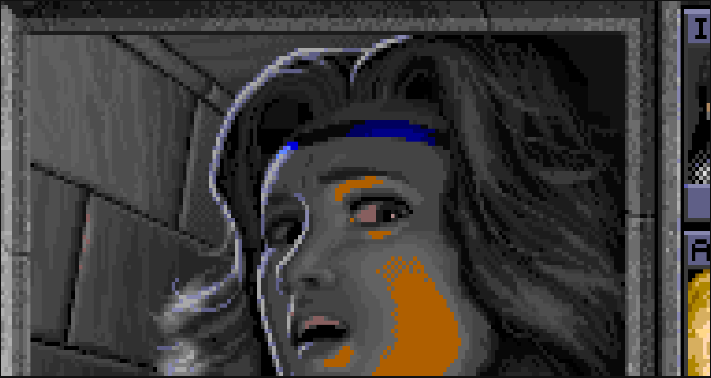

# Navni: A multi-backend character/pixel graphics display library

Navni is intended as a display library for both text graphics and pixel art
games. It can be built for either a native TTY console or for a desktop GUI
window, and text graphics will use the native TTY display on TTY.

You need to pick the backend using feature flags when using Navni, either
`--features=tty` for TTY or `--features=gui` for the GUI desktop backend. To
test the examples, run

    cargo run --features=tty --example demo

or

    cargo run --features=gui --example demo

Navni takes responsibility for the
["magical"](https://stackoverflow.com/a/16444789) platform-specific I/O
interfaces involved in making a game, and only for those. It will not provide
any game development functionality that's purely computational, such as
pathfinding, procedural generation or sprite sheet management.

## Features

- Async execution model for the game loop allows writing complex user
  interface control flow without having to make everything into an explicit
  state machine.
- Simple mouse and keyboard event handling.
- Logging backend activator, use syslog logging with TTY builds where you
  can't output extra lines to stdout and a stdout-based logger with Linux GUI
  builds.
- GUI builds can target WASM using miniquad's JavaScript webgl shim.
- File system abstraction that provides machinery for saving and loading
  config and data files that works both on desktop via the host file system
  and in browser WASM builds via HTML Web Storage.

## Obligatory screenshots

GUI | TTY
:---:|:---:
 | 
characters | characters
 | 
pixels | pixels
